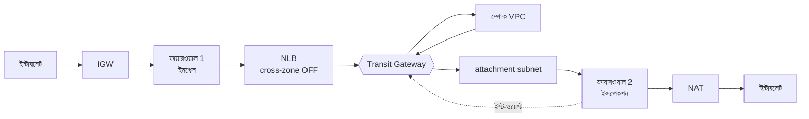

# AWS হাব-অ্যান্ড-স্পোক আর্কিটেকচার: ডিজাইন ও সমাধান

২১ সেপ্টেম্বর ২০২৬

## সংক্ষিপ্ত পরিচিতি

এটি একটি প্রোডাকশন-গ্রেড Terraform কোডবেস, যা এক রিজিয়নে ৩০টি স্পোক অ্যাকাউন্টের জন্য কেন্দ্রীয় ফায়ারওয়াল ইন্সপেকশনসহ AWS হাব-অ্যান্ড-স্পোক নেটওয়ার্ক তৈরি করে। মূল শর্ত একটাই — যে প্যাকেট ভেতরে ঢোকে, বাইরে যায়, বা এক স্পোক থেকে অন্য স্পোকে যায়, তার প্রতিটিকে একটি AWS Network Firewall এন্ডপয়েন্ট পার হতেই হবে।

স্পোক VPC-গুলোর নিজস্ব কোনো ইন্টারনেট গেটওয়ে নেই। তাই কোনো স্পোক সরাসরি ইন্টারনেটে বা অন্য স্পোকে পৌঁছাতে পারে না — একমাত্র পথ Transit Gateway হয়ে হাব অ্যাকাউন্টের ফায়ারওয়াল।

## ডিজাইন ও ডেভেলপমেন্ট

কোডবেস দুই স্তরে সাজানো: পুনর্ব্যবহারযোগ্য `modules/` আর অ্যাকাউন্ট-সীমানা মেনে চলা `live/` রুট মডিউল। মোট ৭টি মডিউল, ৬৫টি `.tf` এবং tfvars ফাইল।

| মডিউল | কী বানায় |
| --- | --- |
| `tgw` | Transit Gateway, ৪টি রুট টেবিল, RAM শেয়ার |
| `ingress-vpc` | ইনগ্রেস VPC, ফায়ারওয়াল ১, NLB, IGW edge routing |
| `inspection-vpc` | ইন্সপেকশন VPC, ফায়ারওয়াল ২, NAT, dual return routing |
| `firewall-policy` | শেয়ার্ড রুল গ্রুপ ও দুই পলিসি |
| `spoke` | স্পোক অ্যাকাউন্ট — একটি মডিউল, ৩০ বার চলে |
| `vpc-endpoints` | Gateway ও interface endpoint, org-সীমিত পলিসিসহ |
| `ipam` | প্রতি স্পোকের `/16` বরাদ্দ |

ডিজাইনের মূল সিদ্ধান্ত হলো, **একটি স্পোকের জন্য অর্থপূর্ণ ভ্যারিয়েবল মাত্র একটি — তার `/16`**। বাকি সব সাবনেট `cidrsubnet()` দিয়ে সেখান থেকেই বের হয়, আর `/16` আসে IPAM থেকে — হাতে লেখা হয় না, তাই দুটি স্পোকের CIDR কখনও সংঘর্ষ করতে পারে না। ফলে ৩১তম স্পোক যোগ করতে শুধু একটি নতুন tfvars ফাইল লাগে, কোডে এক লাইনও বদলাতে হয় না।

আরও দুটি বিষয় শুরু থেকেই ঠিক করা হয়েছে। প্রতিটি রিসোর্সে বাধ্যতামূলক ট্যাগ — `Environment`, `Owner`, `CostCenter`, `ManagedBy = "terraform"`। আর remote state S3-তে, DynamoDB লকিংসহ, এবং হাব ও স্পোকের state সম্পূর্ণ আলাদা রাখা হয় — এক অ্যাকাউন্টের ভুল যেন অন্য অ্যাকাউন্টকে না ছোঁয়।

## এটি কীভাবে কাজ করে

তিনটি পথই ফায়ারওয়াল পার হয়, তবে আলাদা ফায়ারওয়াল ও আলাদা পলিসি দিয়ে।

- **ভেতরে আসা:** IGW edge route table ইনবাউন্ড ট্রাফিক লোড ব্যালান্সারের **আগেই** ফায়ারওয়ালে পাঠায়।
- **বাইরে যাওয়া:** ইন্সপেকশন VPC-তে ফায়ারওয়াল আগে, NAT পরে — তাই ফায়ারওয়াল আসল সোর্স IP দেখতে পায়।
- **স্পোক থেকে স্পোক:** ট্রাফিক TGW হয়ে ইন্সপেকশন VPC-তে যায়, ফায়ারওয়াল পার হয়ে আবার TGW-তে ফেরে — NAT পর্যন্ত পৌঁছায় না।

এই তিনটি পথকে আলাদা রাখে TGW-এর **৪টি রুট টেবিল**: `spoke`, `inspection`, `ingress`, `hybrid`। সবচেয়ে গুরুত্বপূর্ণ হলো `spoke` টেবিলটিতে **কেবল একটি ডিফল্ট রুট** — `0.0.0.0/0` → ইন্সপেকশন VPC। স্পোকের CIDR কখনও এখানে propagate করা হয় না।

আর দুই দিকের ট্রাফিক যেন একই AZ-এর এন্ডপয়েন্টে পৌঁছায়, সেজন্য ইন্সপেকশন VPC-এর attachment-এ `appliance_mode_support = "enable"` দেওয়া হয়েছে — শুধু সেখানেই, স্পোক attachment-এ নয়। এটি না থাকলে stateful ফায়ারওয়াল ফিরতি ট্রাফিক drop করতো।

## কী পাওয়া গেছে

মূল WhatsApp ছবিটি প্রজেক্ট ফোল্ডারে নেই, তাই মূল ডিজাইন সম্পর্কে যা বলা যায় তা সীমিত। তিনটি ভাগ আলাদা করে দেওয়া হলো — কোনটি প্রমাণিত, কোনটি অনুমান, আর কোনটি মূল ছবির সঙ্গে সম্পর্কিতই নয়।

**ক। নিশ্চিত — মূল ডিজাইনের সমস্যা (১টি)**

প্যাকেটের পথে Lambda। মূল ডিজাইন flow symmetry সমস্যাটি Lambda দিয়ে সমাধান করতে চেয়েছিল — অর্থাৎ চলমান অবস্থায় কোড চালিয়ে রুট টেবিল বদলানো। Lambda ব্যর্থ হলে বা দেরি করলে রুট ভুল থাকে, আর নেটওয়ার্কের আসল অবস্থা Terraform-এর state থেকে সরে যায়।

প্রমাণ: v2 ডায়াগ্রামে সরাসরি লেখা আছে — "this is what the original design tried to do with Lambda"।

**খ। অনুমান — যাচাই করা যায়নি (১টি)**

NLB-এ AWS WAF। v2 ডায়াগ্রামের নোটে শুধু বলা আছে যে WAF নেটওয়ার্ক লোড ব্যালান্সারে যুক্ত করা যায় না, তাই এটি CloudFront-এ বসানো হয়েছে। এটি বর্তমান ডিজাইনের ব্যাখ্যা — মূল ছবিতে WAF ভুল জায়গায় ছিল কিনা, তা কোথাও নথিভুক্ত নয়।

**গ। মূল ছবির সমস্যা নয় — যে ঝুঁকি থেকে কোডবেস রক্ষা করে (৫টি)**

এই পাঁচটি আসে `TERRAFORM-BUILD-PROMPT.md`-এর নিয়ম থেকে, মূল ছবি থেকে নয়। এগুলোর বিপদ হলো এগুলো **নীরবে ব্যর্থ হয়** — Terraform এরর দেয় না, plan পাস করে, apply হয়ে যায়, কিন্তু ফায়ারওয়াল আসলে ট্রাফিক দেখেই না।

| ঝুঁকি | কী ঘটে |
| --- | --- |
| স্পোক CIDR TGW spoke রুট টেবিলে propagate করা | TGW সুনির্দিষ্ট রুট পেয়ে ডিফল্টের বদলে সেটা বেছে নেয় — স্পোক থেকে স্পোক ট্রাফিক ফায়ারওয়াল এড়িয়ে যায় |
| appliance mode না দেওয়া | একটি flow-এর দুই দিক দুই AZ-এর এন্ডপয়েন্টে পড়ে, stateful ফায়ারওয়াল ফিরতি প্যাকেট drop করে |
| attachment subnet-এ শুধু ডিফল্ট রুট | ইস্ট-ওয়েস্ট ট্রাফিক TGW-তে না ফিরে NAT দিয়ে ইন্টারনেটে চলে যায় |
| NLB-তে cross-zone চালু | flow অন্য AZ-এ সরে যায় এবং ফায়ারওয়াল state হারায় |
| NAT আগে, ফায়ারওয়াল পরে | ফায়ারওয়াল শুধু NAT-এর IP দেখে, কে পাঠাল বোঝা যায় না |

## কী করা হয়েছে

উপরের প্রতিটি ঝুঁকির বিপরীতে একটি করে কাঠামোগত সিদ্ধান্ত আছে, এবং প্রতিটি সিদ্ধান্তের পাশে একটি করে স্বয়ংক্রিয় যাচাই — যাতে ভুলটি পরে নীরবে ফিরে আসতে না পারে।

| কী করা হয়েছে | কোথায় | কোন যাচাই এটি ধরে |
| --- | --- | --- |
| Lambda-এর বদলে `appliance_mode_support = "enable"` — AWS নিজেই flow কে তার নিজের AZ-এ পিন করে | `modules/inspection-vpc` | appliance mode শুধু inspection attachment-এ |
| প্যাকেটের পথে একটিও Lambda বা EventBridge রুল নেই | পুরো কোডবেস | data path-এ Lambda/EventBridge নেই |
| `spoke` রুট টেবিলে কোনো propagation নেই, শুধু ডিফল্ট রুট | `modules/tgw` | spoke রুট টেবিলে propagation নেই |
| attachment subnet-এ দুটি রুট: `10.0.0.0/8` → TGW ও `0.0.0.0/0` → NAT | `modules/inspection-vpc` | দুই রুটের উপস্থিতি |
| NLB-তে `enable_cross_zone_load_balancing = false` | `modules/ingress-vpc` | cross-zone বন্ধ আছে |
| ফায়ারওয়াল আগে, NAT পরে | `modules/inspection-vpc` | রুটিং ক্রম যাচাই |
| প্রতিটি রুট নিজ AZ-এর এন্ডপয়েন্টে — `{ az => endpoint_id }` ম্যাপ থেকে | উভয় VPC মডিউলে | — (plan mode-এ যাচাইযোগ্য) |
| S3-এর জন্য ফ্রি gateway endpoint | `modules/vpc-endpoints` | S3 gateway endpoint ব্যবহার করে |
| প্রতিটি interface endpoint-এ `aws:PrincipalOrgID` শর্ত | `modules/vpc-endpoints` | সব endpoint org-সীমিত |

এই যাচাইগুলো চালায় `scripts/verify_architecture.py`। এটি দুইভাবে চলে: সরাসরি `.tf` ফাইল পড়ে (ক্রেডেনশিয়াল লাগে না), অথবা `terraform plan`-এর JSON পড়ে — দ্বিতীয়টি প্রকৃত রিসোর্স দেখে, তাই ভ্যারিয়েবলের নাম বদলে দিলেও তাকে ফাঁকি দেওয়া যায় না।

একটি কথা স্পষ্ট করা দরকার: এই তালিকার বেশিরভাগই মূল ছবির ভুল শোধরানো নয় — এগুলো শুরু থেকেই স্পেক অনুসারে ঠিকভাবে বানানো হয়েছে। মূল ডিজাইনের যে সমস্যাটি নিশ্চিতভাবে সমাধান করা হয়েছে, সেটি একটিই — Lambda।

## বর্তমান অবস্থা ও বাকি কাজ

২১ সেপ্টেম্বর ২০২৬ তারিখে চালানো যাচাইয়ে সব গেট পাস করেছে: `terraform fmt` পরিষ্কার, `live/hub` ও `live/spokes` দুটিই `terraform validate`-এ সফল, এবং `verify_architecture.py`-এর **১৩টি পরীক্ষার সবকটি পাস**।

তিনটি কাজ এখনও বাকি:

- [ ] **ইগ্রেস ডোমেইন ফিল্টারিং পূর্ণ করা।** `allowed_domains` ভ্যারিয়েবলটি ঘোষণা করা আছে কিন্তু কোথাও ব্যবহার হয় নি — এখন শুধু DENYLIST চলছে, ফলে ইগ্রেস কার্যত default-allow।
- [ ] **`stateful_default_actions` সেট করা।** দুটি পলিসিই STRICT_ORDER ব্যবহার করে, কিন্তু ডিফল্ট অ্যাকশন দেওয়া নেই, তাই মিল না হওয়া ট্রাফিক পাস করে যায়।
- [ ] **ভার্শন কন্ট্রোলে আনা।** প্রজেক্টের কোনো git রিপো নেই — ৪৯টি ইনফ্রা ফাইলের কোনো ইতিহাস রক্ষিত হচ্ছে না।

একটি সীমাবদ্ধতা মনে রাখা দরকার: যাচাই স্ক্রিপ্টটি এখন পর্যন্ত কেবল source mode-এ চালানো হয়েছে। স্ক্রিপ্ট নিজেই বলছে যে source mode পাস করলেও ডিপ্লয়মেন্ট ভুল হতে পারে — চূড়ান্ত প্রমাণ হলো plan mode, যেটির জন্য AWS ক্রেডেনশিয়াল দরকার।
